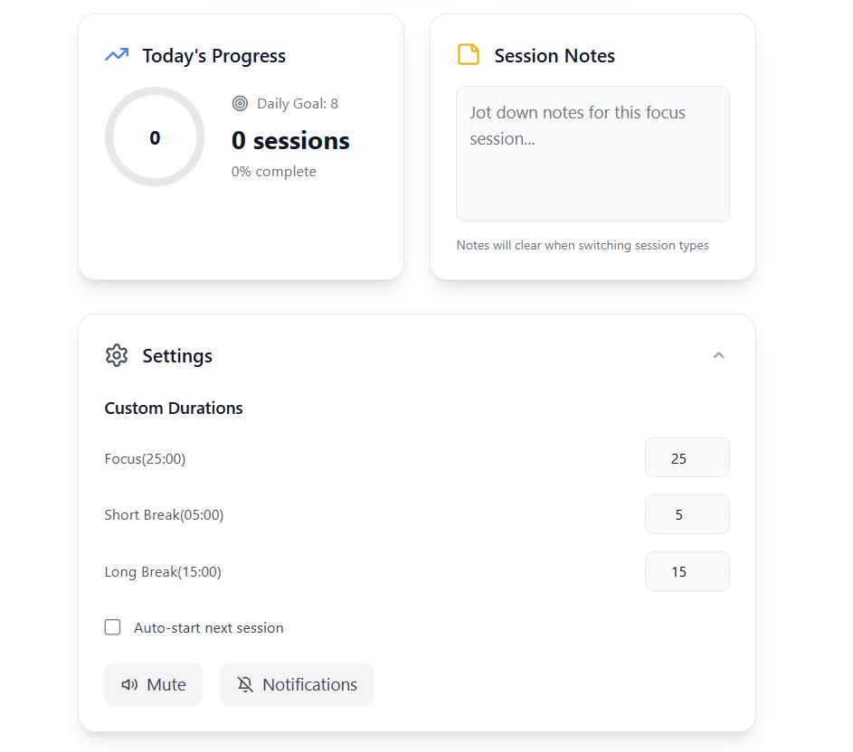

<div align="center">
   <h1>PomoGo 🍅</h1>
   <p><strong>The ultimate Pomodoro focus app to boost your productivity with customizable timers, progress tracking, and distraction-free sessions.</strong></p>
   <p>
      <a href="https://github.com/Jithendra1101" target="_blank">GitHub</a> |
      <a href="https://linkedin.com/in/jithendra11" target="_blank">LinkedIn</a> |
      <a href="mailto:gjithendravarma@gmail.com">Email</a>
   </p>
   
   
</div>

# 🍅 Ultimate Pomodoro Focus App

A beautiful, feature-rich Pomodoro timer application built with React, TypeScript, and Tailwind CSS. Stay productive and focused with customizable sessions, smart notifications, and comprehensive tracking.

## ✨ Features

### 🎯 **Core Functionality**
- **Multiple Session Modes**: Focus (25min), Short Break (5min), Long Break (15min)
- **Smart Timer Controls**: Start, Pause, Reset with visual progress tracking
- **Auto-Progression**: Automatic transition between sessions with cycle management
- **Customizable Durations**: Set your own session lengths (1-120 minutes)

### 🔔 **Smart Notifications**
- **Sound Notifications**: Gentle completion sounds with mute toggle
- **Desktop Notifications**: Browser notifications when sessions complete
- **Visual Feedback**: Dynamic progress bars and status indicators

### 📊 **Productivity Tracking**
- **Daily Statistics**: Track completed focus sessions with visual progress
- **Goal Management**: Set and monitor daily productivity targets
- **Cycle Counter**: Pomodoro technique cycle tracking (4 focus → 1 long break)

### 🎨 **Beautiful Design**
- **Minimal Theme**: Clean white/dark theme with smooth transitions
- **Responsive Layout**: Perfect on desktop, tablet, and mobile devices
- **Smart Colors**: Background adapts to current session type
- **Smooth Animations**: Subtle micro-interactions and hover effects

### 💡 **Advanced Features**
- **Session Notes**: Capture thoughts and tasks for each session
- **Keyboard Shortcuts**: Full keyboard control for power users
- **Fullscreen Mode**: Distraction-free focus environment
- **Favicon Updates**: Timer displays in browser tab
- **Local Storage**: All settings and progress automatically saved

## 🚀 Getting Started

### Prerequisites
- Node.js (v16 or higher)
- npm or yarn package manager

### Installation

1. **Clone the repository**
   ```bash
   git clone https://github.com/Jithendra1101/pomodoro-focus-app.git
   cd pomodoro-focus-app
   ```

2. **Install dependencies**
   ```bash
   npm install
   ```

3. **Start development server**
   ```bash
   npm run dev
   ```

4. **Open in browser**
   Navigate to `http://localhost:5173`

### Build for Production
```bash
npm run build
npm run preview
```

## ⌨️ Keyboard Shortcuts

| Shortcut | Action |
|----------|--------|
| `Space` | Start/Pause timer |
| `R` | Reset current timer |
| `F` | Switch to Focus mode |
| `S` | Switch to Short Break mode |
| `L` | Switch to Long Break mode |

## 🎨 Customization

### Theme Options
- **Light Mode**: Clean, minimal white interface
- **Dark Mode**: Comfortable dark theme for low-light environments
- **Auto Theme**: Respects system preferences

### Session Customization
- **Focus Sessions**: 1-120 minutes (default: 25min)
- **Short Breaks**: 1-120 minutes (default: 5min)
- **Long Breaks**: 1-120 minutes (default: 15min)
- **Auto-Start**: Toggle automatic session transitions

## 🏗️ Technical Architecture

### Built With
- **React 18** - Modern UI library with hooks
- **TypeScript** - Type-safe development
- **Tailwind CSS** - Utility-first styling
- **Vite** - Fast development and building
- **Context API** - Global state management

### Key Components
```
src/
├── components/          # Reusable UI components
├── contexts/           # React contexts for global state
├── hooks/              # Custom React hooks
├── types/              # TypeScript type definitions
├── utils/              # Helper functions
└── App.tsx             # Main application component
```

### Features Implementation
- **Timer Logic**: Custom `useTimer` hook with interval management
- **Keyboard Shortcuts**: `useKeyboardShortcuts` hook with event handling
- **Local Storage**: Automatic persistence of all settings and progress
- **Notifications**: Web Notifications API integration
- **Sound System**: Web Audio API for completion sounds
- **Fullscreen API**: Native fullscreen mode support

## 📱 Progressive Web App

The application is designed with PWA principles:
- **Responsive Design**: Works seamlessly on all device sizes
- **Fast Loading**: Optimized bundle size and lazy loading
- **Offline Ready**: Core functionality works without internet
- **Mobile Optimized**: Touch-friendly interface

## 🔧 Configuration

### Environment Variables
No environment variables required - the app works out of the box!

### Browser Support
- Chrome/Chromium (recommended)
- Firefox
- Safari
- Edge

### Permissions Required
- **Notifications**: For session completion alerts
- **Fullscreen**: For distraction-free mode (optional)

## 🎯 Usage Tips

### Pomodoro Technique Best Practices
1. **Focus Sessions**: Dedicate full attention to one task
2. **Short Breaks**: Step away from your workspace
3. **Long Breaks**: Take a proper rest (15-30 minutes)
4. **Cycle Tracking**: Complete 4 focus sessions before long break

### Productivity Recommendations
- Set realistic daily goals (6-8 focus sessions)
- Use session notes to capture insights
- Take breaks seriously - they're essential for sustained focus
- Experiment with session lengths to find your optimal rhythm

## 🤝 Contributing

We welcome contributions! Please follow these steps:

1. **Fork the repository**
2. **Create a feature branch**: `git checkout -b feature/amazing-feature`
3. **Commit changes**: `git commit -m 'Add amazing feature'`
4. **Push to branch**: `git push origin feature/amazing-feature`
5. **Open a Pull Request**

### Development Guidelines
- Follow TypeScript best practices
- Write clean, self-documenting code
- Add proper error handling
- Test on multiple browsers
- Ensure mobile responsiveness

## 📋 Roadmap

### Upcoming Features
- [ ] **Statistics Export**: Download productivity reports
- [ ] **Goal Streaks**: Track consecutive successful days
- [ ] **Team Mode**: Share sessions with colleagues
- [ ] **Focus Music**: Built-in background sounds
- [ ] **Task Integration**: Connect with todo lists
- [ ] **Advanced Analytics**: Detailed productivity insights

### Version History
- **v1.0.0**: Initial release with core features
- **v1.1.0**: Added dark mode and keyboard shortcuts
- **v1.2.0**: Implemented statistics and cycle tracking

## 🐛 Bug Reports & Feature Requests

Found a bug or have a feature idea? Please use our issue tracker:

1. **Search existing issues** to avoid duplicates
2. **Use the appropriate template** (bug report/feature request)
3. **Provide detailed information** including steps to reproduce
4. **Add screenshots** if applicable


## 👨‍💻 Author

**Jithendra Varma**
- Portfolio: [jithendra.in](https://jithendra.in)
- LinkedIn: [linkedin.com/in/jithendra11](https://linkedin.com/in/jithendra11)
- GitHub: [github.com/Jithendra1101](https://github.com/Jithendra1101)

## 🙏 Acknowledgments

- **Francesco Cirillo** - Creator of the Pomodoro Technique
- **Tailwind CSS Team** - For the amazing utility-first CSS framework
- **React Team** - For the powerful UI library
- **Lucide Icons** - Beautiful open-source icons
- **Pexels** - High-quality stock photos

## ⭐ Support

If you find this project helpful, please consider:
- ⭐ **Starring the repository**
- 🐛 **Reporting bugs**
- 💡 **Suggesting new features**
- 🤝 **Contributing code**
- 📢 **Sharing with others**

---

<div align="center">
   <p>Made with ❤️ by Jithendra Varma</p>
   <p>Happy focusing! 🍅</p>
</div>